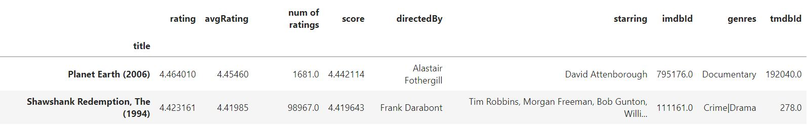

# Recommendation_system_Project

Heroku app:
[https://lalarecommend.herokuapp.com/](https://lalarecommend.herokuapp.com/)

Tableau link:
[https://public.tableau.com/app/profile/laleh.safarzadeh/viz/Movielens_16538832918640/Moviedashboard](https://public.tableau.com/app/profile/laleh.safarzadeh/viz/Movielens_16538832918640/Moviedashboard)

presentation link:
[https://docs.google.com/presentation/d/1HSpohOYa2elciH2EIx_TYmOR9Bv5bEh8rsrf0vWC2cs/edit?usp=sharing](https://docs.google.com/presentation/d/1HSpohOYa2elciH2EIx_TYmOR9Bv5bEh8rsrf0vWC2cs/edit?usp=sharing)

# Dataset
[https://grouplens.org/datasets/movielens/](https://grouplens.org/datasets/movielens/)

F. Maxwell Harper and Joseph A. Konstan. 2015. The MovieLens Datasets: History and Context. ACM Transactions on Interactive Intelligent Systems (TiiS) 5, 4: 19:1–19:19. https://doi.org/10.1145/2827872

1. MovieLens 25M Dataset: 
25 million ratings and one million tag applications applied to 62,000 movies by 162,000 users, Released 12/2019.

2. MovieLens Tag Genome Dataset 2021:
10.5 million computed tag-movie relevance scores from a pool of 1,084 tags applied to 9,734 movies. Released 12/2021. I used the metadata in raw dataset.

# ETL

[0-ETL.ipynb](Notebooks/0-ETL.ipynb) After some merging and cleaning process data was transformed to local mongoDB and AWS service. After loading the dataset from AWS I blocked the public acess and  I will deleated the files from AWS. If anyone wanted to access the dataset please use this [https://grouplens.org/datasets/movielens/](https://grouplens.org/datasets/movielens/). 

# Analysis

Seaborn, Matplotlib, Pandas were the libraries that I used for visulization of finding most popular movie, the distribution of movies genres, the number of movies for years between 1995_2019 and most common words in movies title and some other visulization that you can check in the [1_vis.ipynb](Notebooks/1_vis.ipynb)

# Dashboard 

[https://public.tableau.com/app/profile/laleh.safarzadeh/viz/Movielens_16538832918640/Moviedashboard](https://public.tableau.com/app/profile/laleh.safarzadeh/viz/Movielens_16538832918640/Moviedashboard)

An interactive dashboard was made in Tableau website. Year and genre and avarage rating can be the options to change the graphs.

# Recommendation system
There are 2 kind of Recommendation system, Collaborative Based Filtering and Content-Based Filtering. Spark and sklearn was used for colabrating filtering and Sklearn was used for Content-Based Filtering.

# 1. Collaborative Based Filtering

## 1. Collaborative Based Filtering: Sklearn

In the first attemp I used sklearn pairwise libraries, as the dtaset was too big, a sample of dataset was used and that wasn't give a sensable RMSE. RMSE= 3.4

## 2. Collaborative Based Filtering: Suprise 

In the second attempt I used the powerful recommendation libraries called Suprise, eventhough a sample of dataset was used the RMSE got very low, There are a cross validation in this libraries called cross_validate that you can use for optimisation, after optimizing the RMSE got almost 0.87.

### an example of Recommendation 

## 3. Collaborative Based Filtering: Spark
 
For sklearn I had to use a sample of dataset but spark can handle a big data so I used the whole dataset for training in Spark.In the first attempt the rmse was 0.9 so I used a for loop for rank and regularization param and the RMSE got 0.8 which is pretty cool.

### an example of prediction for a user in Spark

### an example of recommendation 

It shows these movie ids recommends for some userid s.

# 2. Content Based Filtering

## preprocessing
For content based filtering the keys was having genres, stars and directer. And as we wanted a good movies to recommend and need a sample dataset for deploying (limitation in heroku), I used IMDB formula to filter qualified movies, so after some merging and concatening the last version of dataframe was look like below:

This dataframe was needed for deploying, but for trainning I just need genres, staring and directer column. after some text processing a new data frame was created that included these 3 columns without space. 

## CountVectorizing
A matrix was made after cont vectorising (11428, 29882).

## Cosine_similarity

By using one of Sklearn libraries called cosine_similarity, a matrix of item similarity was made. (11428, 11428) 

## Recommending

A costum function was made which get the cosin_similarity matrix and the a movie and then can give the recommendation: below is an example of recommendation for a user that like Sabrina movie:

## checking the recommendation

For checking how close the movies are to Sabrina movies:

We can see the genres is almost the same and some stars and directors are in more than one movies.

## Pickling

Pickling the matrix was more complex than usuall model, it is much heavy so I used compress-pickle.

